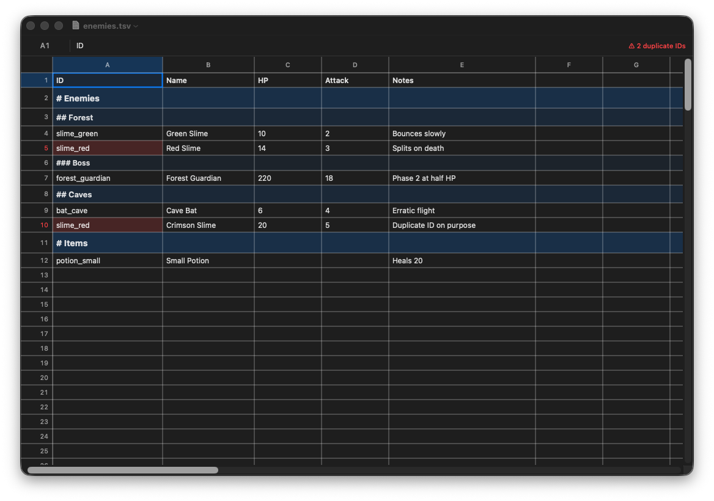

# TSVee

A native, sleek macOS spreadsheet editor for raw **TSV** files — built for game
data tables. No cell types, no formulas, no surprises in your diffs: the file
on disk is always plain tab-separated text.



## Build & run

```sh
make run        # builds a release TSVee.app into dist/ and opens it
swift test      # unit tests for the model and TSS parsing
```

Requires Xcode command-line tools. You can also `open Package.swift` in Xcode
and run the `TSVee` target from there (note: file-type association and the
document-based niceties come from `Support/Info.plist`, which only the `make
bundle` app carries).

## The rules

1. **Column A is always `ID`**, and IDs must be unique per row. TSVee never
   blocks your typing — duplicate IDs are tinted red (cell + row number), a
   `⚠ N duplicate IDs` badge appears in the formula bar, and clicking it (or
   Sheet → Jump to Next Duplicate ID, ⇧⌘D) cycles through the offenders.
2. **`#` IDs are section headers.** `#` is a top-level header, `##` a
   subheader, `###` (or more) the lowest tier. Header rows get graduated
   accent tints, bolder/larger type, and taller rows — and are exempt from the
   uniqueness rule, so two `## Stats` sections under different headers are
   fine.
3. If row 1's ID cell is literally `ID`, it's treated as the **field-name
   row**: styled bold and exempt from uniqueness.
4. Empty IDs are allowed (and exempt from uniqueness).

## Google-Sheets-isms

- Column letters / row numbers, accent-colored range selection, a formula bar
  with an `A1` name box that edits the raw cell value.
- Type into a selected cell to start editing; **Enter** commits and moves
  down (⇧Enter up), **Tab** right (⇧Tab left), **Esc** cancels. Double-click
  or Enter to edit in place. Arrow keys navigate; ⇧-arrows extend the
  selection.
- Copy/cut/paste whole rectangular blocks as TSV — round-trips cleanly with
  Google Sheets, Excel, and Numbers.
- Click row numbers / column letters to select whole rows/columns; drag a
  column edge in the letter band to resize.
- The grid extends past your data with phantom rows/columns; editing one
  grows the file (trailing empty rows/columns are trimmed on save).
- Right-click for insert/delete row & column operations (also in the Sheet
  menu). The ID column can't be deleted or displaced.
- Full undo/redo, autosave-in-place, and Versions via the standard document
  system.

## `.tss` — Tab Separated Support (stubbed)

Formatting never pollutes the TSV. A sibling sidecar carries it instead:
`data.tsv` + `data.tss` in the same folder. If the sidecar exists it's loaded
with the document; it's written on save **only** if there's formatting worth
persisting (a plain TSV never grows a stray `.tss`).

v0 wire format — one tab-separated record per line:

```
tss	0
colwidth	<columnIndex>	<points>
rowheight	<rowIndex>	<points>
```

Column widths are the only thing the UI writes today (drag-resize a column,
save). Unknown record types are preserved verbatim on rewrite, so future
fields — cell styles, merged headers, calculated columns — can be added in
`TSSFormat.swift` without breaking older files. That's the extension point:
add a record type to `parse`/`serialize` and consume it in
`SpreadsheetView`.

## Layout

```
Sources/TSVee/
  SpreadsheetModel.swift        the TSV grid: parsing, mutations, undo, unique-ID checks
  TSSFormat.swift               the .tss sidecar (stub v0)
  TSVDocument.swift             NSDocument glue: read/write TSV + sidecar
  SpreadsheetView.swift         custom-drawn grid (only visible cells render — big files stay fast)
  FormulaBarView.swift          name box + raw value editor + duplicate-ID badge
  DocumentWindowController.swift
  MainMenu.swift / AppDelegate.swift / main.swift
Support/Info.plist              app bundle metadata + .tsv file association
Tests/TSVeeTests/               model + TSS unit tests
```

## Roadmap

- Freeze the field-name row (and `#` headers?) while scrolling
- Row-height drag-resize (the model + `.tss` already support it)
- Find & replace, sort-within-section
- `.tss`: cell styles, column types, calculated columns
